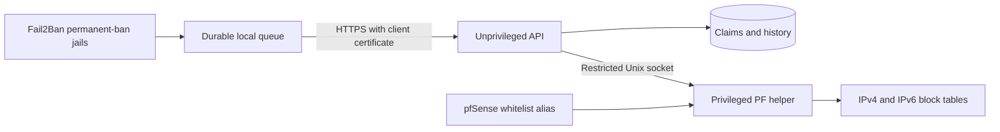

# pfSense Fail2Ban Guard

Development implementation of a pfSense package that accepts qualified Fail2Ban bans from multiple servers. **This is not a production release.** Automatic permanent escalation is intentionally absent. An IP remains blocked only while at least one authorized endpoint reports an active qualifying claim; a whitelist always takes precedence.

## Components

- `src/f2bguard`: HTTPS/mTLS receiver, SQLite state and a separate privileged PF helper.
- `client`: Linux Fail2Ban action, durable sender and periodic complete state reconciliation.
- `pfsense`: native pfSense UI, package metadata and lifecycle integration.
- `tests`: protocol, state, sender and security regression tests.

The receiver runs without root privileges. Only the local PF helper runs as root. Its Unix socket accepts replacements of two fixed IP tables; it cannot execute caller-supplied commands, select arbitrary tables, or alter general firewall configuration. The privileged helper independently enforces the root-managed whitelist.



## Supported policy

Only Fail2Ban bans with no expiry qualify in this first implementation. Temporary bans are not promoted merely because a server reports them. Repeated delivery and repeated sightings do not create permanent blocks. A client can release only its own claim; release by another client cannot remove it. Client silence is not an unban. Complete snapshots reconcile missed events, and sequence numbers prevent delayed messages from resurrecting released claims.

History is for audit only. Disabling a client, removing a jail, deleting the sender database, or restoring an old backup is an administrative lifecycle operation: review stale claims and sequence state explicitly. Do not reuse an endpoint identity with a reset sequence counter.

## Development checks

From this directory:

```sh
PYTHONPATH=src:. python3 -m unittest discover -s tests -v
python3 tools/check.py
```

`tools/check.py` also lints package PHP when `PHP_BIN` is set or a `php` binary is available. Use `--require-php` in release checks. Runtime requires Python 3.11 or newer and the standard library; there are no third-party Python runtime dependencies.

See [the shared protocol](docs/implementation-contract.md), [security and release gates](docs/security-and-release.md), [pfSense integration](docs/pfsense-integration.md), and [sender setup](client/README.md).

## HA status

**Runtime claim replication and automatic HA failover are not implemented in this development baseline.** CARP, pfsync and pfSense XMLRPC do not replicate this application's SQLite state. Running an independent receiver on both firewalls is not a supported HA configuration. Do not point clients at a CARP API address until state replication and failover recovery have been implemented and tested.

See [testing](docs/testing.md) for the scope of automated and native validation.

## Build and package layout

The FreeBSD port is in `pfsense/`. Package metadata, lifecycle hooks, service
registration and native PHP pages follow the pfSense package framework. See
[Netgate compatibility](docs/netgate-compliance.md) and [building](docs/build.md).

GitHub Actions runs validation and builds a package artifact. Artifacts are
experimental; they are not official Netgate releases. HA claim replication
remains a release blocker.
